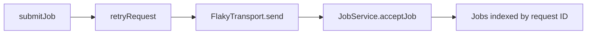

# Threadnote demo

[](https://github.com/Kashkovsky/threadnote-demo/actions/workflows/ci.yml)

A small, runnable repository for introducing [Threadnote](https://threadnote.io) to engineering teams.

**The story:** one engineer learns why retries must preserve an operation's identity. They save and deliberately share that decision. A teammate's coding agent retrieves it, checks the source, and uses it when planning a related change.

## Run the example

Use Node.js **24.12 or later in the 24.x line, or 26+**, and npm.

```sh
git clone https://github.com/Kashkovsky/threadnote-demo.git
cd threadnote-demo
npm ci
npm run demo:compare
```

No server, credentials, or Threadnote installation is required to run the example. The transport simulates response loss in memory, so the same scenario repeats every time.

| Scenario             | First attempt                                 | Retry                       | Jobs created |
| -------------------- | --------------------------------------------- | --------------------------- | ------------ |
| Intentionally unsafe | `request-1` creates `job-1`; response is lost | `request-2` creates `job-2` | **2**        |
| Safe                 | `request-1` creates `job-1`; response is lost | `request-1` returns `job-1` | **1**        |

```sh
npm run demo          # Safe implementation
npm run demo:unsafe   # Deliberately incorrect example
npm run typecheck
npm test
```

The unsafe command succeeds when it reproduces the expected duplicate-job outcome. Both scenarios assert their expected result; the unsafe implementation is isolated under `examples/`.

## Follow the code



This diagram explains runtime flow. Inspect Threadnote's actual returned edges when demonstrating its graph; the retry callback and transport interface may appear as separate relationships.

| File                                                             | Role                                                                           |
| ---------------------------------------------------------------- | ------------------------------------------------------------------------------ |
| [src/jobs/submit-job.ts](src/jobs/submit-job.ts)                 | Creates one request for a logical submission.                                  |
| [src/network/retry.ts](src/network/retry.ts)                     | Retries response loss within a bounded attempt budget.                         |
| [src/network/flaky-transport.ts](src/network/flaky-transport.ts) | Loses responses after the service has accepted a request.                      |
| [src/server/job-service.ts](src/server/job-service.ts)           | Returns the existing job for a repeated request ID; rejects conflicting input. |
| [examples/unsafe-submit-job.ts](examples/unsafe-submit-job.ts)   | Generates a new request ID inside every retry.                                 |

## Record the Threadnote walkthrough

Use the [recording guide](demo/recording-guide.md) for the ten-minute sequence, exact prompts, code-graph commands, and teammate setup requirements. A [sample decision](demo/retry-contract.md) provides reviewable wording to adapt after inspecting the source.

The sample decision is a Markdown teaching fixture. Cloning this repository does **not** import, store, or publish any Threadnote memory. A real cross-user demonstration needs two independent Threadnote environments and a separately configured demo memory Git repository. All memory-sharing actions remain explicit.

An ordinary follow-up task to give the second engineer:

> Add bounded exponential backoff to job submission. Use Threadnote to find relevant decisions, inspect the current source, and explain your plan before editing.

Backoff is intentionally left as a follow-up task. The current retry loop has no delay.

## What is tested

Vitest checks the lost-response regression, the unsafe counterexample, distinct submissions, conflicting reuse of an ID, input snapshotting, retry exhaustion, and permanent errors. Two bounded Fast-check properties check that:

- one logical submission creates one job across varying response-loss counts and attempt budgets;
- arbitrary repeated request sequences create as many jobs as there are distinct request IDs.

GitHub Actions runs type checking, formatting, the full test suite, and both executable scenarios.

## Demo scope

All names and data are fictional. This is a single-process, in-memory teaching example: it has no persistence, authentication, real HTTP transport, or distributed concurrency control. Its guarantee lasts for one `JobService` instance and assumes unique IDs for independent submissions. Exhausting retries can leave an accepted job whose result the client has not received.

MIT licensed. The demo is independently authored example code; Threadnote has its own license and installation requirements.
